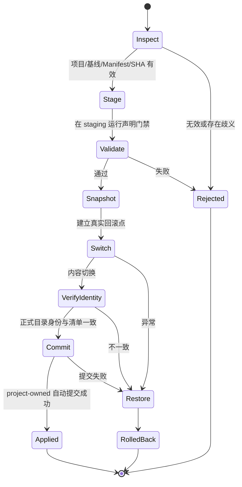

# update.transaction

更新根目录固定为 `/Users/sakana/Downloads/GPT-Projects/`。不按项目目录分流，只读取根级 ZIP 中唯一 `update-manifest.json`。

流程：验包 → staging 完整检查一次 → 建立回滚点 → 内容切换 → 正式目录轻量身份检查 → 自动提交 project-owned 代码 → 归档更新包。失败自动恢复。

保护 `.git`、`.flow/local.json`、`.flow/state`、`.venv`、`.idea`、日志、dist、`data/raw_data` 和全部 generated-state。更新与回滚自动提交 project-owned 内容，但不自动推送、打 Tag 或发布；受保护状态即使已暂存，也会在提交前自动退回未暂存状态。

当前 project-owned 工作区不必预先干净。只要其内容身份精确等于更新包 `baseIdentity`，就视为可解释的上一版状态，staging 会以当前工作树而不是旧 `HEAD` 为基线。这样旧版 Flow 留下的“已应用但未提交”状态可以直接继续更新，并在新提交中一次性收口。

Staging 候选只验证 project-owned 代码与控制面，不要求受保护的 generated-state 已同步到目标代码版本。正常 `flow check` 与生成数据发布门禁仍执行完整一致性校验；因此 generated-state 可以在代码更新后由 `flow run` 独立重建。

候选版本使用 SemVer 排序；正式版本高于同版本预发布，`rc.10` 高于 `rc.2`。同一最高目标版本出现多个包时拒绝猜测。

## 事务状态机

## 不变量

- 更新包所属项目只由 Manifest 决定，文件名和目录名没有权威性。推荐文件名为 `kancolle-spider-update-<targetVersion>.zip`；不在文件名重复编码 `from-to`，源版本与目标版本由 Sidecar 和 Manifest 精确声明。
- 同一次安装不对同一代码重复执行多轮完整静态套件。
- staging 未通过时正式目录保持原样。
- 切换后失败必须自动恢复，不要求人寻找事务目录。
- 成功返回时 project-owned 工作区必须干净，并记录更新 Commit；generated-state 保持独立。
- 正常回滚生成反向 Commit，不留下“恢复内容已暂存”的中间状态。
- 成功后不自动推送、不发布 main、不发布 npm。
- 迁移回滚需要移除 `.flow` 时，失败版本快照必须先归档到统一恢复目录，输出不得指向即将删除的事务路径。

## Flow content baseline v2

Flow 更新判定以 Flow 自己维护的 content identity 为准，Git 只作为落地存储、回滚和审计工具。

- `.flow/baseline.json` 是 Flow authority state，可被 Git 跟踪，但不参与 `flow-content-sha256` 计算，避免循环依赖。
- `flow-content-sha256` 只覆盖 project-owned 受控文件，排除 `.git/`、`.flow/local.json`、`.flow/local/**`、`.flow/state/**`、`.flow/baseline.json`、本机配置、缓存、dist、generated-state 等内容。
- 业务 update package v2 写入 `from.contentHash`、`to.contentHash`、`payloadHash`、`lockHash` 与 `quickReceiptHash`。
- `quickReceiptHash` 对应包内 `quick-receipt.json`，Receipt 必须绑定目标 `contentHash` 与 dependency `lockHash`。
- 更新应用成功后写入新的 `.flow/baseline.json` 并与 project-owned 变化一起自动 commit；commit 失败则 update 不算闭环。
- 业务 update package 不携带 `.git`；Recovery Package 可以继续携带 Git bundle，但仅用于恢复。

判断顺序固定为：当前内容 hash 匹配 accepted baseline → payload/staging 后目标内容 hash 匹配 target → quick receipt 与 lock hash 匹配 → 替换工作区 → 写 Flow baseline → git commit。

## Flow packageVersion / AI 降耗暂行规则

- `packageVersion` 是 project 维度全局递增序号，跨 `projectVersion` 不重置。
- `projectVersion` 只记录业务版本变化，不参与筛包硬条件；update 串链只要求同 project、packageVersion 更高、`from.contentHash == current contentHash`。
- `1001+` update 包是单文件自描述 ZIP，机器读取包内 `flow-package.json` / `update-manifest.json`，不再依赖外部 sidecar。
- 同一 project + 同一 packageVersion 出现不同 `payloadHash` / `from.contentHash` / `to.contentHash` 时必须停止，禁止按文件时间或文件名猜测。
- package sync 只修 `.flow/baseline.json`，不修改项目内容；只有当前 contentHash 能唯一匹配已知 update target 时才允许自动同步。
- `.flow/packages/` 和下载根目录是 update 输入目录；已归档 applied 包只作审计，不再参与自动扫描。
- 确定性事务不得消耗 AI 算力：包选择、baseline 对账、幂等判断、缺前置包诊断、package sync 和自动串链都必须由 Flow 机械完成。

